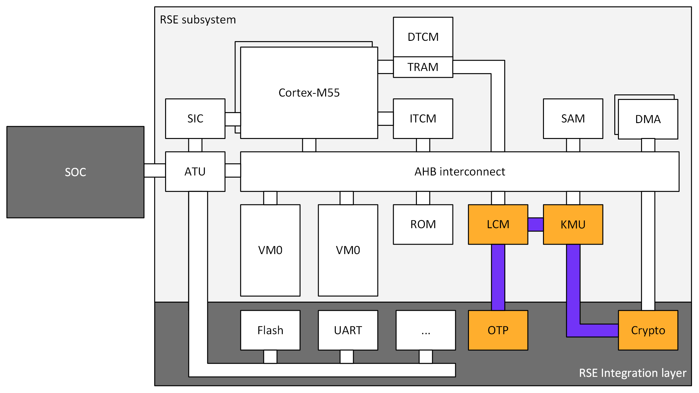

RSE Cryptography
================

This document provides details of the cryptography performed by the
Runtime Security Engine (RSE).

Its primary use is as a guide to a software developer who is porting the
reference RSE software to an RSE platform which does not use the
reference Arm Cryptocell cryptographic acclerator. To facilitate this,
it contains:

-  A list of algorithms required to be supported at each stage of RSE
   boot
-  A list of APIs which must be reimplemented if the cryptographic
   accelerator is replaced, and the required semantics of those
   implementations.
-  A list of functions which must be replaced if the cryptographic
   accelerator is replaced, and the required semantics of those
   replacements.
-  A guide to the required level of side-channel protection a
   replacement cryptographic accelerator and driver must provide in
   order to maintain RSE security.
-  Some basic information about how different cryptographic accelerators
   are integrated into the RSE hardware, to aid in the software
   integration

BL1
===

Currently, the BL1 bootloader calls into the RSE crypto accelerator via
a combination of three separate APIs:

1. The BL1 crypto api (as defined in
   ``bl1/bl1_1/shared_lib/interface/crypto.h``),
2. The cc3xx ``low_level_driver`` API (as defined in
   ``platform/ext/target/arm/drivers/cc3xx/low_level_driver/include/``)

This makes it difficult to substitute the cc3xx in the RSE integration
layer, requiring some rewriting of the ROM code. This is a known
limitation, and is planned to be fixed by using the (thin) PSA crypto
API in BL1 in the medium term.

BL1 Bootloader usage
--------------------

BL1_1
~~~~~

BL1_1 uses a hash function to validate the BL1_2 bootloader image in OTP
against a hash stored in OTP. This hash is then recorded as a boot
measurement for use in attestation.

The hash algorithm used will be one of the following: [1]_

-  SHA256
-  SHA384

BL1_2
~~~~~

BL1_2 MAY use a symmetric decryption function to decrypt the BL2 image.
This decryption MAY happen in-place.

The decryption algorithm will be one of the following: [2]_

-  AES CTR

BL1_2 uses an asymmetric algorithm to validate the image. This algorithm
will be one of the following: [3]_

-  LMS
-  ECDSA

If the algorithm used in LMS, it will use the ``LMS_SHA256_M32_H10`` and
``LMOTS_SHA256_N32_W8`` parameter sets.

If the algorithm used is ECDSA, the curve/hash pair used will be one of
the following:

-  NIST SECP-256-r1 with SHA256
-  NIST SECP-384-r1 with SHA384

Provisioning usage
------------------

If ``RSE_SYMMETRIC_PROVISIONING`` is enabled, BL1_1 uses a symmetric
AEAD algorithm to decrypt and verify the provisioning blob. This
algorithm will be one of the following:

The decryption algorithm will be one of the following: [4]_

-  AES CCM

If ``RSE_SYMMETRIC_PROVISIONING`` is not enabled, BL1_1 uses an
asymmetric algorithm to verify the blob. This algorithm will be one of
the following: [5]_

-  ECSDA

If the algorithm used is ECDSA, the curve/hash pair used will be one of
the following:

-  NIST SECP-256-r1 with SHA256
-  NIST SECP-384-r1 with SHA384

If ``RSE_SYMMETRIC_PROVISIONING`` is not enabled, BL1_1 may use a
symmetric algorithm to decrypt the blob. This algorithm will be one of
the following: [6]_

-  AES CCM

The decryption algorithm will be one of the following: [7]_

-  AES CTR

Usage of the BL1 crypto API
---------------------------

All functions in the BL1 crypto API MUST be implemented. The semantics
for the implementation must match the semantics described in the `BL1
crypto API documentation <#bl1-crypto-api>`__. The implementations MUST
include the required level of `side-channel
countermeasures <#side-channel-countermeasures>`__

Usage of the cc3xx ``low_level_driver`` API
-------------------------------------------

The following cc3xx functions are directly called. If the integration
uses a different cryptographic accelerator, the functions MUST be
replaced. The semantics for the replacement calls must match the
semantics described in the `cc3xx ``low_level_driver`` API
documentation <#cc3xx-low-level-driver-api>`__

``boot_hal_bl1_1.c``
~~~~~~~~~~~~~~~~~~~~

-  ``cc3xx_lowlevel_init``
-  ``cc3xx_lowlevel_dma_remap_region_init``
-  ``cc3xx_lowlevel_dma_burst_restricted_region_init``

``boot_hal_bl1_2.c``
~~~~~~~~~~~~~~~~~~~~

-  ``cc3xx_lowlevel_uninit``

``rse_kmu_keys.c``
~~~~~~~~~~~~~~~~~~

-  ``cc3xx_lowlevel_kdf_cmac``

``rse_provisioning_blob_handler.c``
~~~~~~~~~~~~~~~~~~~~~~~~~~~~~~~~~~~

-  ``cc3xx_lowlevel_aes_init``
-  ``cc3xx_lowlevel_aes_set_tag_len``
-  ``cc3xx_lowlevel_aes_set_data_len``
-  ``cc3xx_lowlevel_aes_update_authed_data``
-  ``cc3xx_lowlevel_aes_update``
-  ``cc3xx_lowlevel_aes_set_output_buffer``
-  ``cc3xx_lowlevel_aes_finish``

BL2
===

The BL2 bootloader calls into the RSE crypto accelerator using only the
RSE Cryptoprocessor Driver Interface (also referred to as the PSA driver
API).

BL2 Bootloader usage
--------------------

BL2 uses an asymmetric algorithm to validate each image. This algorithm
will be one of the following: [8]_

-  ECDSA

If the algorithm used is ECDSA, the curve/hash pair used will be one of
the following:

-  NIST SECP-256-r1 with SHA256
-  NIST SECP-384-r1 with SHA384

BL2 may use a symmetric algorithm to decrypt each image. This algorithm
will be one of the following: [9]_

-  AES CTR

The key used in this symmetric decryption will be included in the image
metadata. To secure the key in transport, a key wrapping algorithm will
be used. This algorithm will be one of the following: [10]_

-  AES KW

BL2 usage of the PSA driver API
-------------------------------

The following PSA driver API functions are required. If the integration
uses a different cryptographic accelerator, it MUST have a PSA driver
API driver which implements the entry points required for these
functions. The semantics of the entry points MUST be as described in the
`PSA driver API <https://github.com/Mbed-TLS/TF-PSA-Crypto/blob/main/docs/proposed/psa-driver-interface.md#driver-entry-point>`_.
Entry points my be integrated either by patching the
``psa_crypto_driver_wrappers.h``, or by using the
`.json description file <https://github.com/Mbed-TLS/TF-PSA-Crypto/blob/main/docs/proposed/psa-driver-interface.md#driver-description-syntax>`_.
Note that it is valid for the driver to return ``PSA_ERROR_NOT_SUPPORTED`` for
these entry points, as long as that function isn’t required for any RSE
usecases. The implementations MUST include the required level of `side-channel
countermeasures <#side-channel-countermeasures>`__

``thin_psa_crypto_core.c``
~~~~~~~~~~~~~~~~~~~~~~~~~~

-  ``psa_driver_wrapper_init``
-  ``psa_driver_wrapper_free``
-  ``psa_driver_wrapper_hash_abort``
-  ``psa_driver_wrapper_hash_compute``
-  ``psa_driver_wrapper_hash_finish``
-  ``psa_driver_wrapper_hash_setup``
-  ``psa_driver_wrapper_hash_update``
-  ``psa_driver_wrapper_verify_hash``

RSE Cryptographic hardware
==========================

Diagram
-------

   RSE hardware diagram, with the cryptographic components colorized

RSE Cryptographic accelerator
-----------------------------

The RSE cryptographic accelerator is within the RSE integration layer,
and therefore is not included with the base RSE subsystem. The
integrator MUST integrate an RSE cryptographic accelerator into the RSE
integration layer.

The RSE MUST contain a hardware cryptographic accelerator.

The cryptographic engine MUST support acceleration of AES-256-CTR. The
AES acceleration MUST include one or more registers with both write-only
and write-once semantics which are used to input the key.

The cryptographic accelerator MUST support acceleration of one of the
following:

-  AES-256-CMAC
-  HKDF
-  SP800-108-CTR KDF with a PRF with security strength of at least 256
   bits.

Whichever is chosen MUST include one or more registers with both
write-only and write-once semantics which are used to input the input
key for the operation.

The cryptographic accelerator SHOULD support acceleration of the
following hash functions:

-  SHA256
-  SHA384

The cryptographic accelerator SHOULD support acceleration of one of the
following:

-  SHA256 hash-chaining
-  LMS verification

The cryptographic accelerator MUST support acceleration of all of the
following:

-  ECDSA with the NIST SECP_256_R1 curve
-  ECDSA with the NIST SECP_384_R1 curve

The ECDSA acceleration SHOULD include one or more registers with both
write-only and write-once semantics which are used to input the input
key for the operation.

The cryptographic accelerator SHOULD support acceleration ML-DSA. The
ML-DSA acceleration SHOULD include one or more registers with both
write-only and write-once semantics which are used to input the input
key for the operation.

Key Management Unit (KMU)
-------------------------

The RSE KMU stores keys in protected hardware registers. These registers
are initially write-once read/write, and can then be locked and then
become neither readable nor writable.

The KMU locking operation requires that the following are configured
before locking can occur:

-  The export address
-  The export configuration
-  The key size

The KMU supports 128, 192 and 256 bit keys. RSE symmetric keys MUST be
256 bits.

Once a KMU register is locked, it can be triggered to be exported. The
KMU writes the key to the specified address. Depending on the export
configuration, this can be:

-  Multiple writes to a single key register
-  Writes a set of contiguous key registers

The export register MUST be have both write-only and write-once
semantics.

The KMU also has a set of “Hardware” keys which are input into the KMU
from the LCM when the LCM is released from reset. Hardware keyslots are
identical to locked software keyslots. The number of hardware keyslots,
export address, configuration and key size are configured by RSE RTL
parameters.

A keyslot can be “invalidated”, erasing the key material and unlocking
the slot to be reused. Note that Hardware keyslots cannot be reused
after being invalidated. Note that invalidation does not permanently
destroy hardware keys, as they are still stored in the OTP; after a
reset the LCM will once again export them to the KMU ready to be used.

The integrator MUST prevent bus transactions initiated by the KMU from
being read by any other entity in the system. The recommended
integration is a private bus between the KMU and the cryptographic
accelerator.

The KMU supports masking transactions with a random mask to mitigate
power analysis attacks in transit. Cryptographic accelerators MUST
support unmasking the KMU transactions.

Life Cycle Manager (LCM)
------------------------

The LCM performs two functions in the hardware cryptographic flows.

It performs access control on the OTP memory which contains the Hardware
keys. The Hardware key memory is not readable except under the following
circumstances.

``LCS == LCM_LCS_CM && LCM_SP_ENABLE == true``:

-  ``HUK`` is Read/Write
-  ``GUK`` is Read/Write
-  ``KCE_CM`` is Read/Write
-  ``KP_CM`` is Read/Write

``LCS == LCM_LCS_DM && LCM_SP_ENABLE == true``:

-  ``KCE_DM`` is Read/Write
-  ``KP_DM`` is Read/Write

``LCS == LCM_LCS_RMA``:

-  ``HUK`` is Write-only
-  ``GUK`` is Write-only
-  ``KCE_CM`` is Write-only
-  ``KP_CM`` is Write-only
-  ``KCE_DM`` is Write-only
-  ``KP_DM`` is Write-only

The second function the LCM performs is to export the hardware keys into
the KMU hardware keyslots. The mapping between the keys and keyslots is
detailed below.

========== ===========
Key        KMU slot ID
========== ===========
``KRTL``   0
``HUK``    1
``GUK``    2
``KP_CM``  3
``KCE_CM`` 4
``KP_DM``  5
``KCE_DM`` 6
========== ===========

Keys in OTP memory are protected from tampering by a zero-count. The LCM
hardware performs a chech between the key and the zero-count on every
reset, and if the zero counts do not match the key is not exported to
the KMU.

Runtime Crypto partition
========================

The Runtime Cryptography partition provides cryptographic services to
other secure partitions within the RSE, and if configured callers
outside the RSE. These services are provided via the `PSA crypto
api <https://arm-software.github.io/psa-api/crypto/>`__, and the
services that RSE provides may vary depending on the usecase.

Default Crytocell driver support
--------------------------------

The cc3xx driver supports the following algorithms:

Hash
~~~~

-  ``PSA_ALG_SHA_256``

MAC
~~~

-  ``PSA_KEY_TYPE_AES``

   -  ``PSA_ALG_CMAC``

Cipher
~~~~~~

-  ``PSA_KEY_TYPE_AES``

   -  ``PSA_ALG_ECB``
   -  ``PSA_ALG_CTR``
   -  ``PSA_ALG_CBC``

AEAD
~~~~

-  ``PSA_KEY_TYPE_AES``

   -  ``PSA_ALG_CCM``

Key derivation
~~~~~~~~~~~~~~

-  ``PSA_KEY_TYPE_AES``

   -  ``PSA_ALG_SP800_108_COUNTER_CMAC``

Asymmetric Signature
~~~~~~~~~~~~~~~~~~~~

-  ``PSA_ALG_ECDSA``

   -  ``PSA_ECC_FAMILY_SECP``

Key agreement
~~~~~~~~~~~~~

-  ``PSA_ALG_ECDH``

   -  ``PSA_ECC_FAMILY_SECP``

Additionally, ``PSA_ALG_SHA_384`` is supported in a software
implementation, in order to support ECDSA signing with the
``SECP_384_R1`` curve.

Runtime usage of the PSA driver API
-----------------------------------

The following PSA driver API functions are required. If the integration
uses a different cryptographic accelerator, it MUST have a PSA driver
API driver which implements the entry points required for these
functions. The semantics of the entry points MUST be as described in the
`PSA driver API <https://github.com/Mbed-TLS/TF-PSA-Crypto/blob/main/docs/proposed/psa-driver-interface.md#driver-entry-point>`_.
Entry points my be integrated either by patching the
``psa_crypto_driver_wrappers.h``, or by using the
`.json description file <https://github.com/Mbed-TLS/TF-PSA-Crypto/blob/main/docs/proposed/psa-driver-interface.md#driver-description-syntax>`_.
Note that it is valid for the driver to return ``PSA_ERROR_NOT_SUPPORTED`` for
these entry points, as long as that function isn’t required for any RSE
usecases. The implementations MUST include the required level of `side-channel
countermeasures <#side-channel-countermeasures>`__

``psa_crypto_driver_wrappers.c``
~~~~~~~~~~~~~~~~~~~~~~~~~~~~~~~~

-  ``psa_driver_wrapper_init``
-  ``psa_driver_wrapper_free``
-  ``psa_driver_wrapper_sign_message``
-  ``psa_driver_wrapper_verify_message``
-  ``psa_driver_wrapper_sign_hash``
-  ``psa_driver_wrapper_verify_hash``
-  ``psa_driver_wrapper_generate_key``
-  ``psa_driver_wrapper_cipher_encrypt``
-  ``psa_driver_wrapper_cipher_decrypt``
-  ``psa_driver_wrapper_cipher_encrypt_setup``
-  ``psa_driver_wrapper_cipher_decrypt_setup``
-  ``psa_driver_wrapper_cipher_set_iv``
-  ``psa_driver_wrapper_cipher_update``
-  ``psa_driver_wrapper_cipher_finish``
-  ``psa_driver_wrapper_cipher_abort``
-  ``psa_driver_wrapper_hash_compute``
-  ``psa_driver_wrapper_hash_abort``
-  ``psa_driver_wrapper_hash_finish``
-  ``psa_driver_wrapper_hash_setup``
-  ``psa_driver_wrapper_hash_update``
-  ``psa_driver_wrapper_hash_clone``
-  ``psa_driver_wrapper_aead_encrypt``
-  ``psa_driver_wrapper_aead_decrypt``
-  ``psa_driver_wrapper_aead_encrypt_setup``
-  ``psa_driver_wrapper_aead_decrypt_setup``
-  ``psa_driver_wrapper_aead_set_nonce``
-  ``psa_driver_wrapper_aead_set_lengths``
-  ``psa_driver_wrapper_aead_update_ad``
-  ``psa_driver_wrapper_aead_update``
-  ``psa_driver_wrapper_aead_finish``
-  ``psa_driver_wrapper_aead_verify``
-  ``psa_driver_wrapper_aead_abort``
-  ``psa_driver_wrapper_mac_compute``
-  ``psa_driver_wrapper_mac_sign_setup``
-  ``psa_driver_wrapper_mac_verify_setup``
-  ``psa_driver_wrapper_mac_update``
-  ``psa_driver_wrapper_mac_update``
-  ``psa_driver_wrapper_mac_sign_finish``
-  ``psa_driver_wrapper_mac_verify_finish``
-  ``psa_driver_wrapper_mac_abort``
-  ``psa_driver_wrapper_asymmetric_encrypt``
-  ``psa_driver_wrapper_asymmetric_decrypt``
-  ``psa_driver_wrapper_key_agreement``

``psa_crypto_driver_wrappers_no_static.c``
~~~~~~~~~~~~~~~~~~~~~~~~~~~~~~~~~~~~~~~~~~

-  ``psa_driver_wrapper_export_public_key``

Security strength requirements
==============================

All keys used in RSE MUST have a 256-bit or greater security strength.

Side-channel countermeasures
============================

Secret handling countermeasures
-------------------------------

-  Any Bus parity or DCLS alarms MUST be connected to SAM alarms.

Fault Injection countermeasures
~~~~~~~~~~~~~~~~~~~~~~~~~~~~~~~

-  Secrets used for encryption or signing MUST be copied only by bus
   initiators protected by Dual-Core LockStep (DCLS).
-  Secrets used for encryption or signing MUST only be copied over
   busses protected by partity or other error-correction hardware.
-  Secrets used for decryption or verification MAY be protected in the
   same way.
-  Secret operations SHOULD use software fault injection
   countermeasures.

Power and EM side-channel countermeasures
~~~~~~~~~~~~~~~~~~~~~~~~~~~~~~~~~~~~~~~~~

-  Secrets MUST be copied in the largest block possible.
-  The order of the block copies in a secret copy MUST be randomized.
-  Secrets copies SHOULD NOT include intermediate copies.

Timing side-channel countermeasures
~~~~~~~~~~~~~~~~~~~~~~~~~~~~~~~~~~~

-  Secrets MUST be compared by constant-time functions.
-  Secrets MUST be copied by constant-time functions.

AES countermeasures
-------------------

-  AES hardware MUST connect any hardware countermeasure alarms to the
   SAM.

.. _fault-injection-countermeasures-1:

Fault Injection countermeasures
~~~~~~~~~~~~~~~~~~~~~~~~~~~~~~~

-  AES implementations MUST implement one of the following (which can
   both either be on a per-round or a per-operation basis):

   -  Double-encrypt and compare results
   -  Encrypt-then-decrypt and compare to plaintext

-  AES implememtations SHOULD use software fault injection
   countermeasures within the driver.

.. _power-and-em-side-channel-countermeasures-1:

Power and EM side-channel countermeasures
~~~~~~~~~~~~~~~~~~~~~~~~~~~~~~~~~~~~~~~~~

-  AES implementations must include dummy rounds, inserted at random
   into the encryption and decryption operations.
-  AES implementations must include masking of intermediate values.

   -  If double-encrypt and compare is implemented, the two operations
      MUST use different masks.

.. _timing-side-channel-countermeasures-1:

Timing side-channel countermeasures
~~~~~~~~~~~~~~~~~~~~~~~~~~~~~~~~~~~

-  AES operations MUST be constant-time

KDF countermeasures
-------------------

-  Key derivation hardware MUST connect any hardware countermeasure
   alarms to the SAM.

.. _fault-injection-countermeasures-2:

Fault Injection countermeasures
~~~~~~~~~~~~~~~~~~~~~~~~~~~~~~~

-  KDF implementations MUST implement Double-encrypt and compare results
   (which can both either be on a per-round or a per-operation basis)
-  KDF implememtations SHOULD use software fault injection
   countermeasures within the driver.

.. _power-and-em-side-channel-countermeasures-2:

Power and EM side-channel countermeasures
~~~~~~~~~~~~~~~~~~~~~~~~~~~~~~~~~~~~~~~~~

-  KDF implementations must include dummy rounds, inserted at random
   into the encryption and decryption operations.
-  KDF implementations must include masking of intermediate values.

   -  If double-encrypt and compare is implemented, the two operations
      MUST use different masks.

.. _timing-side-channel-countermeasures-2:

Timing side-channel countermeasures
~~~~~~~~~~~~~~~~~~~~~~~~~~~~~~~~~~~

-  KDF operations MUST be constant-time

ECDSA countermeasures
---------------------

-  ECDSA hardware MUST connect any hardware countermeasure alarms to the
   SAM.

.. _fault-injection-countermeasures-3:

Fault Injection countermeasures
~~~~~~~~~~~~~~~~~~~~~~~~~~~~~~~

-  ECDSA implementations MUST include integrity checks on in-use curve
   parameters
-  ECDSA implementations MUST include checks that any input, output or
   intermediate points are valid curve points.
-  ECDSA implememtations SHOULD use software fault injection
   countermeasures within the driver.

.. _power-and-em-side-channel-countermeasures-3:

Power and EM side-channel countermeasures
~~~~~~~~~~~~~~~~~~~~~~~~~~~~~~~~~~~~~~~~~

-  ECDSA sign implementations MUST use projective coordinates with
   randomized ``z`` coordinates
-  ECDSA sign implementations MUST use lookup tables to perform windowed
   point multiplication.
-  ECDSA sign implementations MUST perform scalar splitting
-  ECDSA sign implementations MUST perform scalar blinding

.. _timing-side-channel-countermeasures-3:

Timing side-channel countermeasures
~~~~~~~~~~~~~~~~~~~~~~~~~~~~~~~~~~~

-  ECDSA sign operations MUST be constant-time

Software fault injection countermeasures
----------------------------------------

The following software fault injection countermeasures SHOULD be used in
security-critical code which is vulnerable to fault injection, for
example, branches into lower-security boot paths, setup of security
hardware, or cryptographic accelerator drivers.

-  Critical variables SHOULD use high hamming-weights
-  Return values SHOULD use high hamming-weights
-  Critical checks SHOULD be performed multiple times
-  Random delays SHOULD be inserted before critical operations

These SHOULD be implemented using the ``fih.h`` header library: \* Any
variables used for implementing branches SHOULD be of type ``fih_int``
\* Any branches should use ``fih_eq`` or ``fih_not_eq`` \* Function
calls SHOULD use ``FIH_CALL``. Any function called by ``FIH_CALL`` MUST
return using ``FIH_RET`` \* Additional delays MAY be inserted using
``fih_delay``

The ``fih.h`` library MUST be configured with the following options:

-  ``TFM_FIH_PROFILE_ON``
-  ``FIH_ENABLE_DELAY``

It MAY be configured with additional options.

BL1 crypto API
==============

This section documents the semantics of various functions in the BL1
crypto API.

crypto.h
--------

``bl1_hash_compute``
~~~~~~~~~~~~~~~~~~~~

.. code:: c

   fih_int bl1_hash_compute(enum tfm_bl1_hash_alg_t alg,
                            const uint8_t *data,
                            size_t data_length,
                            uint8_t *hash,
                            size_t hash_length,
                            size_t *hash_size);

This function computes a hash in a single call. All data to be hashed
must be in a contiguous buffer and be available when this function is
called.

This function MUST compute a hash of the data at the ``data`` pointer of
size ``data_length``.

The hash MUST be copied to the ``hash`` pointer, and must not exceed
``hash_length`` in size. If the calculated hash is larger that
``hash_length``, and error MUST be returned. The value at the
``hash_size`` pointer MUST be set to the size of the hash, except in the
pointer is ``NULL`` in which case it MUST NOT be set.

If the ``alg`` argument is ``TFM_BL1_HASH_ALG_SHA256`` then the hash
MUST be computed using the `SHA-256 hash
algorithm <https://nvlpubs.nist.gov/nistpubs/FIPS/NIST.FIPS.180-4.pdf>`__

If the ``alg`` argument is ``TFM_BL1_HASH_ALG_SHA384`` then the hash
MUST be computed using the `SHA-384 hash
algorithm <https://nvlpubs.nist.gov/nistpubs/FIPS/NIST.FIPS.180-4.pdf>`__

If the ``alg`` argument is any other value, an error MUST be returned.

The implementation MUST pass all NIST CAVP vectors for hashing
`byte-oriented
messages <https://csrc.nist.gov/CSRC/media/Projects/Cryptographic-Algorithm-Validation-Program/documents/shs/shabytetestvectors.zip>`__

The implementation SHOULD pass all NIST CAVP vectors for hashing
`bit-oriented
messages <https://csrc.nist.gov/CSRC/media/Projects/Cryptographic-Algorithm-Validation-Program/documents/shs/shabittestvectors.zip>`__

The implementation MAY include side-channel protections. If side-channel
protections are not included, secret data MUST NOT be input into this
function and This function MUST NOT be used to implement HKDF.

``bl1_hash_init``
~~~~~~~~~~~~~~~~~

.. code:: c

   fih_int bl1_hash_init(enum tfm_bl1_hash_alg_t alg);

This function initializes a multi-part hashing operation, ready for
other functions to be called to input the data.

Before this function is called, the ``bl1_hash_update`` function MUST
NOT be called.

If the ``alg`` argument is ``TFM_BL1_HASH_ALG_SHA256`` then the hash
operation MUST use the `SHA-256 hash
algorithm <https://nvlpubs.nist.gov/nistpubs/FIPS/NIST.FIPS.180-4.pdf>`__

If the ``alg`` argument is ``TFM_BL1_HASH_ALG_SHA384`` then the hash
operation MUST use the `SHA-384 hash
algorithm <https://nvlpubs.nist.gov/nistpubs/FIPS/NIST.FIPS.180-4.pdf>`__

If the ``alg`` argument is any other value, an error MUST be returned.

This function does not include any sort of state object, so hash
operations cannot be interleaved. If ``bl1_hash_init`` has already been
called, and ``bl1_hash_finish`` has not been called to finish the
operation, ``bl1_hash_init`` MUST NOT be called.

``bl1_hash_update``
~~~~~~~~~~~~~~~~~~~

.. code:: c

   fih_int bl1_hash_update(const uint8_t *data,
                           size_t data_length);

This function submits input data to be hashed. It processes the data
according to the initialized hash configuration.

This function MUST input into the hash operation the data at the
``data`` pointer of size ``data_length``.

``bl1_hash_finish``
~~~~~~~~~~~~~~~~~~~

.. code:: c

   fih_int bl1_hash_finish(uint8_t *hash,
                           size_t hash_length,
                           size_t *hash_size);

This function finalizes the hash operation and outputs the hash value.

The hash MUST be copied to the ``hash`` pointer, and must not exceed
``hash_length`` in size. If the calculated hash is larger that
``hash_length``, and error MUST be returned. The value at the
``hash_size`` pointer MUST be set to the size of the hash, except in the
pointer is ``NULL`` in which case it MUST NOT be set.

This function MUST NOT be called if ``bl1_hash_init`` has not been
called.

``bl1_aes_256_ctr_decrypt``
~~~~~~~~~~~~~~~~~~~~~~~~~~~

.. code:: c

   fih_int bl1_aes_256_ctr_decrypt(enum tfm_bl1_key_id_t key_id,
                                   const uint8_t *key_material,
                                   uint8_t *counter,
                                   const uint8_t *ciphertext,
                                   size_t ciphertext_length,
                                   uint8_t *plaintext);

This function computes an AES-CTR decryption with a 256 bit key in a
single call. All data to be decrypted must be in a contiguous buffer and
be available when this function is called.

This function MUST decrypt the data at the ``ciphertext`` pointer of
size ``ciphertext_length``.

The decrypted data MUST be output to the ``plaintext`` pointer, and must
be exactly ``ciphertext_length`` in size.

If the ``key_id`` is ``TFM_BL1_KEY_HUK``, then ``KMU_HW_SLOT_HUK`` MUST
be used in the operation, by the mechanism of being exported from the
KMU directly to the cryptographic accelerator. If this key slot in the
KMU is not valid, this operation MUST return an error. Any key material
passed in ``key_material`` MUST be ignored.

If the ``key_id`` is ``TFM_BL1_KEY_GUK``, then ``KMU_HW_SLOT_GUK`` MUST
be used in the operation, by the mechanism of being exported from the
KMU directly to the cryptographic accelerator. If this key slot in the
KMU is not valid, this operation MUST return an error. Any key material
passed in ``key_material`` MUST be ignored.

If the ``key_id`` is ``TFM_BL1_KEY_BL2_ENCRYPTION``, then
``RSE_KMU_SLOT_CM_IMAGE_ENCRYPTION_KEY`` MUST be used in the operation,
by the mechanism of being exported from the KMU directly to the
cryptographic accelerator. If this key slot in the KMU is not valid,
this operation MUST return an error. Any key material passed in
``key_material`` MUST be ignored.

If the ``key_id`` is ``TFM_BL1_KEY_USER``, then the key passed in the
``key_material`` argument MUST be used in the operation. The ``key_id``
pointer MUST point to a buffer of at least 32 bytes (256 bits) in size.
The key input copying MUST implement the required `side-channel
protections for Secret Handling <#secret-handling-countermeasures>`__.

If the ``key_id`` is any other value, an error MUST be returned.

The implementation MUST pass all NIST CAVP vectors for `AES Known-Answer
Tests <https://csrc.nist.gov/CSRC/media/Projects/Cryptographic-Algorithm-Validation-Program/documents/aes/KAT_AES.zip>`__
where the key length is 256 bits and the mode is CTR.

This function MUST implement the required `side-channel protections for
AES <#aes-countermeasures>`__.

``bl1_derive_key``
~~~~~~~~~~~~~~~~~~

.. code:: c

   fih_int bl1_derive_key(enum tfm_bl1_key_id_t key_id, const uint8_t *label,
                          size_t label_length, const uint8_t *context,
                          size_t context_length, uint32_t *output_key,
                          size_t output_length);

This function derives an unstructured (symmetric) key from an
unstructured input key.

This function MUST implement either:

-  HMAC-based Extract-and-Expand Key Derivation Function (HKDF) as per
   `RFC5869 <https://www.rfc-editor.org/info/rfc5869>`__

   -  If this is chosen, the underlying hash function and/or the
      hardware-accelerated HKDF implementation MUST implement the
      required `side-channel protections for Key
      Derivation <#kdf-countermeasures>`__.
   -  If this is chosen, the cryptographic accelerator MUST contain a
      key register with write-only and write-once semantics to which the
      KMU can export keys for use in the hardware-accelerated HKDF
      operation only.

-  Counter Mode key derivation with AES-CMAC as the chosen pseudorandom
   function (PRF) as per `NIST
   SP800-108 <https://nvlpubs.nist.gov/nistpubs/SpecialPublications/NIST.SP.800-108r1-upd1.pdf>`__
   This function MUST implement the required level of side-channel
   security

   -  If this is chosen, the underlying AES implementation and/or the
      hardware-accelerated SP800-108-CTR-AES-CMAC implementation MUST
      implement the required `side-channel protections for Key
      Derivation <#kdf-countermeasures>`__.

This function MUST use the data at the ``label`` pointer of size
``label_length`` as the label in the derivation operation.

This function MUST use the data at the ``context`` pointer of size
``context_length`` as the context in the derivation operation.

This function MUST derive at key using the chosen KDF of the size
``output_size`` bytes, and output it to the buffer pointed to by
``output_key``. Key output copying MUST implement the required
`side-channel protections for Secret
Handling <#secret-handling-countermeasures>`__.

This function MUST write the output key using exactly 4-byte sized
writes if the ``output_size`` is 4 byte aligned and the ``output_key``
pointer is 4 byte aligned.

This function MUST support ``output_size == 32`` and
``output_size == 48``. It SHOULD support ``output_size == 16``. It MAY
support other output sizes.

If the ``key_id`` is ``TFM_BL1_KEY_HUK``, then ``KMU_HW_SLOT_HUK`` MUST
be used in the operation, by the mechanism of being exported from the
KMU directly to the cryptographic accelerator. If this key slot in the
KMU is not valid, this operation MUST return an error.

If the ``key_id`` is ``TFM_BL1_KEY_GUK``, then ``KMU_HW_SLOT_GUK`` MUST
be used in the operation, by the mechanism of being exported from the
KMU directly to the cryptographic accelerator. If this key slot in the
KMU is not valid, this operation MUST return an error.

If the ``key_id`` is ``TFM_BL1_KEY_BL2_ENCRYPTION``, then
``RSE_KMU_SLOT_CM_IMAGE_ENCRYPTION_KEY`` MUST be used in the operation,
by the mechanism of being exported from the KMU directly to the
cryptographic accelerator. If this key slot in the KMU is not valid,
this operation MUST return an error.

If the ``key_id`` is any other value, an error MUST be returned.

This function MUST produce identical results to any KDF algorithms used
offline to generate keys, for example, the BL2 encryption key.

``bl1_ecc_derive_key``
~~~~~~~~~~~~~~~~~~~~~~

.. code:: c

   fih_int bl1_ecc_derive_key(enum tfm_bl1_ecdsa_curve_t curve, enum tfm_bl1_key_id_t key_id,
                              const uint8_t *label, size_t label_length,
                              const uint8_t *context, size_t context_length,
                              uint32_t *output_key, size_t output_size);

This function derives a structured ECDSA private key from an
unstructured key.

This function MUST implement either:

-  HMAC-based Extract-and-Expand Key Derivation Function (HKDF) as per
   `RFC5869 <https://www.rfc-editor.org/info/rfc5869>`__ as the DRBG
   used to implement ECDSA key pair generation as per `FIPS 168-5
   (appendix
   A.2) <https://nvlpubs.nist.gov/nistpubs/FIPS/NIST.FIPS.186-5.pdf>`__

   -  If this is chosen, the underlying hash function and/or the
      hardware-accelerated HKDF implementation MUST implement MUST
      implement the required `side-channel protections for Key
      Derivation <#kdf-countermeasures>`__.
   -  If this is chosen, the cryptographic accelerator MUST contain a
      key register with write-only and write-once semantics to which the
      KMU can export keys for use in the hardware-accelerated HKDF
      operation only.

-  Counter Mode key derivation with AES-CMAC as the chosen pseudorandom
   function (PRF) as per `NIST
   SP800-108 <https://nvlpubs.nist.gov/nistpubs/SpecialPublications/NIST.SP.800-108r1-upd1.pdf>`__
   as the DRBG used to implement ECDSA key pair generation as per `FIPS
   168-5 (appendix
   A.2) <https://nvlpubs.nist.gov/nistpubs/FIPS/NIST.FIPS.186-5.pdf>`__
   This function MUST implement the required level of side-channel
   security

   -  If this is chosen, the underlying AES implementation and/or the
      hardware-accelerated SP800-108-CTR-AES-CMAC implementation MUST
      implement the required `side-channel protections for Key
      Derivation <#kdf-countermeasures>`__.

-  Hardware-accelerated ECDSA key derivation compliant with `FIPS
   168-5 <https://nvlpubs.nist.gov/nistpubs/FIPS/NIST.FIPS.186-5.pdf>`__

   -  If this is chosen, the cryptographic accelerator MUST contain a
      key register with write-only and write-once semantics to which the
      KMU can export keys for use in the hardware-accelerated ECDSA
      derivation operation only.

This function MUST derive at key using the chosen KDF of the size
``output_size`` bytes, and output it to the buffer pointed to by
``output_key``. Key output copying MUST implement the required
`side-channel protections for Secret
Handling <#secret-handling-countermeasures>`__.

If the ``curve`` argument is ``TFM_BL1_CURVE_P256`` then the value
output to ``output_key`` MUST be a valid private key for the `NIST
SECP256R1
curve <https://nvlpubs.nist.gov/nistpubs/SpecialPublications/NIST.SP.800-186.pdf>`__

If the ``curve`` argument is ``TFM_BL1_CURVE_P384`` then the value
output to ``output_key`` MUST be a valid private key for the `NIST
SECP384R1
curve <https://nvlpubs.nist.gov/nistpubs/SpecialPublications/NIST.SP.800-186.pdf>`__

The private key output to ``output_key`` must be in  [11]_ format

If the ``curve`` argument is any other value, an error MUST be returned.

This function MUST use the data at the ``label`` pointer of size
``label_length`` as the label in the derivation operation.

This function MUST use the data at the ``context`` pointer of size
``context_length`` as the context in the derivation operation.

This function MUST write the output key using exactly 4-byte sized
writes if the ``output_size`` is 4 byte aligned and the ``output_key``
pointer is 4 byte aligned.

If the ``key_id`` is ``TFM_BL1_KEY_HUK``, then ``KMU_HW_SLOT_HUK`` MUST
be used in the operation, by the mechanism of being exported from the
KMU directly to the cryptographic accelerator. If this key slot in the
KMU is not valid, this operation MUST return an error.

If the ``key_id`` is ``TFM_BL1_KEY_GUK``, then ``KMU_HW_SLOT_GUK`` MUST
be used in the operation, by the mechanism of being exported from the
KMU directly to the cryptographic accelerator. If this key slot in the
KMU is not valid, this operation MUST return an error.

If the ``key_id`` is any other value, an error MUST be returned.

This function MUST produce identical results to any KDF algorithms used
offline to generate keys, for example, the Attestation key.

``bl1_ecdsa_verify``
~~~~~~~~~~~~~~~~~~~~

.. code:: c

   fih_int bl1_ecdsa_verify(enum tfm_bl1_ecdsa_curve_t curve,
                            uint8_t *key, size_t key_size,
                            const uint8_t *hash,
                            size_t hash_length,
                            const uint8_t *signature,
                            size_t signature_size);

This function verifies an ECDSA signature over a hash.

This function MUST use the data at the ``key`` pointer of size
``key_size`` as the ECDSA key. If ``key_size`` is odd, then the first
byte must be ``0x04`` and must be discarded. The remaining ``key``
buffer MUST be used as the public key point in the format ``x || y``
where ``x`` and ``y`` are raw ECDSA coordinates. [12]_

This function MUST use the data at the ``hash`` pointer of size
``hash_len`` as the hash to be verified.

This function MUST use the data at the ``signature`` pointer of size
``signature_len`` as the signature to be verified.

This function MUST return success only if the signature verification
succeeds

This function MUST implement the required `side-channel protections for
ECDSA <#ecdsa-countermeasures>`__.

cc3xx ``low_level_driver`` API
==============================

This section documents the semantics of various functions in the cc3xx
``low_level_driver`` API.

``cc3xx_init.h``
----------------

``cc3xx_lowlevel_init``
~~~~~~~~~~~~~~~~~~~~~~~

.. code:: c

   cc3xx_err_t cc3xx_lowlevel_init(void);

This function initializes the cryptographic accelerator. Before this
function is called, the accelerator MUST NOT be used. After calling it,
the accelerator is ready for use (or an error is returned).

It SHOULD be called in each boot stage, as the cryptographic
accelerator’s state might be stored in data sections that are
reinitialized between stages.

``cc3xx_lowlevel_uninit``
~~~~~~~~~~~~~~~~~~~~~~~~~

.. code:: c

   cc3xx_err_t cc3xx_lowlevel_uninit(void);

This function uninitializes the cryptographic accelerator. Once this is
called, the accelerator MUST NOT be used again until
``cc3xx_lowlevel_init`` is called again.

It SHOULD be called at the end of each boot stage or before reset, to
ensure that any retained state does not leak across stages. It MUST
erase all secret data within the accelerator.

``cc3xx_dma.h``
---------------

``cc3xx_lowlevel_dma_remap_region_init``
~~~~~~~~~~~~~~~~~~~~~~~~~~~~~~~~~~~~~~~~

.. code:: c

   void cc3xx_lowlevel_dma_remap_region_init(uint32_t remap_region_idx,
                                             const cc3xx_dma_remap_region_t *region);

This function configures a memory remap region. Any DMA access to an
address within the specified region is redirected to the calculated
remap base, including an optional per-CPU offset.

It is used when the system requires address translation between CPU and
accelerator access paths—for example, when remapping CPU TCM accesses
for use by the cryptographic engine.

This function MUST be called before accessing memory that requires
remapping by the DMA.

``cc3xx_lowlevel_dma_burst_restricted_region_init``
~~~~~~~~~~~~~~~~~~~~~~~~~~~~~~~~~~~~~~~~~~~~~~~~~~~

.. code:: c

   void cc3xx_lowlevel_dma_burst_restricted_region_init(uint32_t region_idx,
       const cc3xx_dma_burst_restricted_region_t *region);

This function defines a region where the bus does not support burst
transactions. Within this region, the cryptographic engine will use
word-aligned accesses instead of bursts.

This is typically used when writing secret material directly into KMU or
other hardware-protected areas that do not allow burst transfers.

It MUST be called before any DMA accesses to such regions occur.

``cc3xx_aes.h``
---------------

``cc3xx_lowlevel_aes_init``
~~~~~~~~~~~~~~~~~~~~~~~~~~~

.. code:: c

   cc3xx_err_t cc3xx_lowlevel_aes_init(
       cc3xx_aes_direction_t direction,
       cc3xx_aes_mode_t mode, cc3xx_aes_key_id_t key_id,
       const uint32_t *key, cc3xx_aes_keysize_t key_size,
       const uint32_t *iv, size_t iv_len);

This function initializes an AES operation with the specified
parameters.

This function MUST be called before any other AES functions are called.

This function MUST implement the required `side-channel protections for
AES <#aes-countermeasures>`__.

``cc3xx_lowlevel_aes_get_state``
~~~~~~~~~~~~~~~~~~~~~~~~~~~~~~~~

.. code:: c

   void cc3xx_lowlevel_aes_get_state(struct cc3xx_aes_state_t *state);

This function retrieves the current internal state of the AES operation.
It allows pausing and resuming of AES operations across execution
stages.

This function is used in conjunction with
``cc3xx_lowlevel_aes_set_state`` to resume an operation from a
previously saved state.

This function MUST implement the required `side-channel protections for
AES <#aes-countermeasures>`__.

``cc3xx_lowlevel_aes_set_state``
~~~~~~~~~~~~~~~~~~~~~~~~~~~~~~~~

.. code:: c

   cc3xx_err_t cc3xx_lowlevel_aes_set_state(const struct cc3xx_aes_state_t *state);

This function sets the internal state of the AES operation from a
previously saved state. It reinitializes the AES engine based on the
provided state and eliminates the need for a separate call to
``cc3xx_lowlevel_aes_init``.

This function MUST implement the required `side-channel protections for
AES <#aes-countermeasures>`__.

``cc3xx_lowlevel_aes_set_tag_len``
~~~~~~~~~~~~~~~~~~~~~~~~~~~~~~~~~~

.. code:: c

   void cc3xx_lowlevel_aes_set_tag_len(uint32_t tag_len);

This function sets the tag length for authenticated encryption modes
(AEAD), such as GCM or CCM. If called in modes that are not AEAD, this
function is a no-op.

It MAY be called before ``cc3xx_lowlevel_aes_finish`` when using AEAD
modes to ensure proper tag generation or verification. If the function
is not called, then the tag length will be the maximum allowed for that
mode.

``cc3xx_lowlevel_aes_set_data_len``
~~~~~~~~~~~~~~~~~~~~~~~~~~~~~~~~~~~

.. code:: c

   void cc3xx_lowlevel_aes_set_data_len(uint32_t to_crypt_len, uint32_t to_auth_len);

This function sets the expected data lengths for AES operations,
specifically used for CCM mode. It configures how much data will be
encrypted and how much will be authenticated but not encrypted.

This function MUST be called before any data input in CCM mode. It MAY
be called in other modes.

``cc3xx_lowlevel_aes_set_output_buffer``
~~~~~~~~~~~~~~~~~~~~~~~~~~~~~~~~~~~~~~~~

.. code:: c

   void cc3xx_lowlevel_aes_set_output_buffer(uint8_t *out, size_t out_len);

This function specifies the buffer where the AES engine should place its
output. It MUST be called before ``cc3xx_lowlevel_aes_update`` to ensure
that the output has a valid destination.

If the size of the buffer is smaller than the input data, the update
operation will fail.

The output buffer MUST NOT be set when the amount of data input is not a
multiple of 16 bytes.

``cc3xx_lowlevel_aes_update``
~~~~~~~~~~~~~~~~~~~~~~~~~~~~~

.. code:: c

   cc3xx_err_t cc3xx_lowlevel_aes_update(const uint8_t* in, size_t in_len);

This function submits input data to be encrypted or decrypted. It
processes the data according to the initialized AES configuration and
stores the result in the buffer configured via
``cc3xx_lowlevel_aes_set_output_buffer``.

This function MUST NOT be called before ``cc3xx_lowlevel_aes_init`` or
after ``cc3xx_lowlevel_aes_finish``.

This function MUST implement the required `side-channel protections for
AES <#aes-countermeasures>`__.

``cc3xx_lowlevel_aes_update_authed_data``
~~~~~~~~~~~~~~~~~~~~~~~~~~~~~~~~~~~~~~~~~

.. code:: c

   void cc3xx_lowlevel_aes_update_authed_data(const uint8_t* in, size_t in_len);

This function inputs additional authenticated data (AAD) for AEAD/MAC
modes, such as GCM and CCM. It MUST be called before any data is
processed using ``cc3xx_lowlevel_aes_update``.

This function MUST NOT be called after starting data
encryption/decryption (via ``cc3xx_lowlevel_aes_update``). AAD and other
input data cannot be interleaved.

This function MUST implement the required `side-channel protections for
AES <#aes-countermeasures>`__.

``cc3xx_lowlevel_aes_finish``
~~~~~~~~~~~~~~~~~~~~~~~~~~~~~

.. code:: c

   cc3xx_err_t cc3xx_lowlevel_aes_finish(uint32_t *tag, size_t *size);

This function finalizes the AES operation and processes any remaining
buffered data. In AEAD modes, it also produces or verifies the
authentication tag.

If ``tag`` is non-NULL, it will either be written with the generated tag
(encryption) or compared against the provided tag (decryption). The size
of the tag defaults to 16 bytes if not explicitly set via
``cc3xx_lowlevel_aes_set_tag_len``.

This function implicitly uninitializes the AES engine on success. On
failure, the engine must be explicitly uninitialized using
``cc3xx_lowlevel_aes_uninit``.

This function MUST implement the required `side-channel protections for
AES <#aes-countermeasures>`__.

``cc3xx_lowlevel_aes_uninit``
~~~~~~~~~~~~~~~~~~~~~~~~~~~~~

.. code:: c

   void cc3xx_lowlevel_aes_uninit(void);

This function uninitializes the AES engine. It MUST be called once the
AES operation is complete, especially to clear any internal state and
secret keying material.

This function DOES NOT get called implicitly on failure and must be
manually invoked to clean up state even in the case of errors.

``cc3xx_kdf.h``
---------------

``cc3xx_lowlevel_kdf_cmac``
~~~~~~~~~~~~~~~~~~~~~~~~~~~

.. code:: c

   cc3xx_err_t cc3xx_lowlevel_kdf_cmac(
       cc3xx_aes_key_id_t key_id, const uint32_t *key,
       cc3xx_aes_keysize_t key_size,
       const uint8_t *label, size_t label_length,
       const uint8_t *context, size_t context_length,
       uint32_t *output_key, size_t out_length);

This function implements a counter-mode KDF following NIST SP800-108
revision 1 update 1. It uses AES in CMAC mode as the pseudo-random
function, according to SP800-38B.

This function MUST produce identical results to any KDF algorithms used
offline to generate keys, for example, the CM and DM master keys.

This function MUST implement the required `side-channel protections for
Key Derivation <#kdf-countermeasures>`__.

.. [1]
   SM3 might also be used in future

.. [2]
   SM4 CTR might also be used in future

.. [3]
   SM2 might also be used in future

.. [4]
   SM4 CCM might also be used in future

.. [5]
   SM2 might also be used in future

.. [6]
   SM4 CCM might also be used in future

.. [7]
   SM4 CCM might also be used in future

.. [8]
   SM2 might also be used in future

.. [9]
   SM4 CTR might also be used in future

.. [10]
   SM4 KW might also be used in future

.. [11]
   FIXME is it little or big-endian?

.. [12]
   FIXME are they little or big-endian
