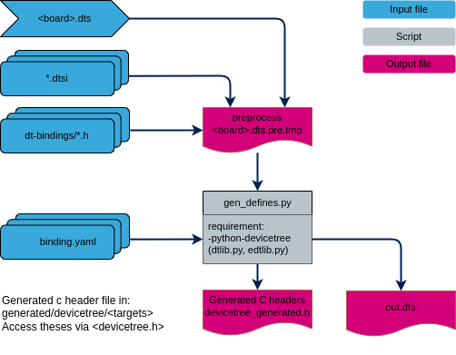

.. _devicetree:

##########
Devicetree
##########

*****************
Scope and purpose
*****************

The Devicetree (DT), is a data structure and language for describing
hardware (inter dependencies between devices). More specifically, it is a
hardware description that is readable by an operating system
so that the operating system doesn't need to hard code details of the machine.

For general devicetree information, documentation is available:

* `Devicetree specification`_
* `Devicetree usage`_
* `Devicetree reference`_

Usually, the DT representation is created and passed to the kernel as a binary
blob (dtb). At runtime the kernel uses a library to parse this blob to look up
the hardware informations. Like this, a kernel can be independant
of hardware description and same kenel can be compatible with several boards, SoC...

However, this way has 2 disadvantages for small systems:

* Increase embedded image size, which integrate parsing library and the blob.
* Increase boot time: each device looks up its information from the blob

In 2016, Zephyr offered an alternative for small systems, which uses the advantage of
DT description whitout the need to parse a blob. This devicetree is based on this alternative.

*******
Concept
*******

There are two types of devicetree input files: devicetree sources (dts, dtsi)
and devicetree bindings (yaml). The sources contain the devicetree itself.
The bindings describe its contents, including data types.
The build system uses devicetree sources and bindings to produce a generated C header.

To simplify, gen_defines.py script creates for each information a define with
specific name and its value.

.. code-block:: devicetree

   / {
	first_node {
		second_node_label: second_node@10000000 {
                        compatible = "foo,foo-compatible";
                        foo-val = <3>;
                        status = "okay";
		};
        };
     };

Example of define's generated in `devicetree_generated.h`

.. code-block:: c

        #define DT_N_S_first_node_S_second_node_10000000_PATH "/first_node/second_node@10000000"
        #define DT_N_S_first_node_S_second_node_10000000_P_compatible {"foo,foo-compatible"}
        #define DT_N_S_first_node_S_second_node_10000000_P_foo_val 3
        #define DT_N_S_first_node_S_second_node_10000000_STATUS_okay 1

The name is built from the devicetree path and key word like (list is not exhaustive):

* ``DT_N`` header for devicetree node
* ``S`` for ``/``
* ``P`` for property

To easily exploit the generated define, some macros are available in "devicetree.h"
or framework include files (clk.h..). All macro names start with ``DT_``.

Example:

.. code-block:: c

        // return node's label property value
        #define DT_LABEL(node_id)
        // return 1 if the node has the property, 0 otherwise.
        #define DT_NODE_HAS_PROP(node_id, prop)
        // return a representation of the property's value
        #define DT_PROP(node_id, prop)
        // return node's register block address
        #define DT_REG_ADDR(node_id)

*****************************
How to add devicetree support
*****************************

To add devicetree support on your target, include:

- the devicetree config file ``config.cmake`` which defines the default devicetree variables.
- the devicetree cmake file ``gen_dt.cmake`` and call the
  ``add_devicetree_target()`` function on an existing CMake target.

This function generates the ``devicetree_generated.h`` header for the target,
creates an ``INTERFACE`` library ``dt_<TARGET>_header`` exposing the include
directories, and a ``STATIC`` library ``dt_<TARGET>_libs`` where devicetree
based drivers (see `How to add device`_) can be added with
``target_sources()``. Both libraries are automatically linked to
``<TARGET>``, and a custom target ``dt_<TARGET>_gen_h`` is created to drive
the header generation.

add_devicetree_target() arguments:

.. list-table::
   :header-rows: 1
   :widths: 20 15 65

   * - Argument
     - Required
     - Description
   * - ``TARGET``
     - Yes
     - Name of an existing CMake target on which devicetree support is
       added. It is used as a prefix to name every generated file, target
       and library (``dt_<TARGET>_gen_h``, ``dt_<TARGET>_header``,
       ``dt_<TARGET>_libs``...).
   * - ``DTS_BOARD``
     - Yes
     - File name of the board devicetree source (dts) to build, e.g.
       ``stm32mp257f-dk.dts``. This file is looked up in the directories
       listed by ``DTS_DIR`` (see below).
   * - ``DTS_DIR``
     - No
     - List of extra directories to search for devicetree sources (dts,
       dtsi) and includes, in addition to the default ones already known
       by the build system (SoC, boards, extension and include
       directories).
   * - ``DTC_FLAGS``
     - No
     - List of extra flags forwarded to the devicetree compiler frontend
       (``gen_edt.py``), e.g. to suppress specific warnings/checks.
   * - ``EXTRA_CPPFLAGS``
     - No
     - List of extra flags forwarded to the C preprocessor used to
       preprocess the devicetree sources, e.g. extra ``-D`` defines used
       by ``#if`` guards in your dts/dtsi files.

Include devicetree config:

.. code-block:: CMake

   # set devicetree config
   if (EXISTS ${STM_DEVICETREE_DIR}/config.cmake)
       include(${STM_DEVICETREE_DIR}/config.cmake)
   endif()

Add devicetree on target:

.. code-block:: CMake

   # include devicetree cmake file in your project
   include(${DEVICETREE_DIR}/gen_dt.cmake)

   # add devicetree support to the "tfm_s" target
   add_devicetree_target(
       TARGET tfm_s
       DTS_BOARD ${DTS_BOARD_S}
       DTS_DIR
           ${MY_DTS_DIR}/devicetree
       DTC_FLAGS
           -Wno-unique_unit_address
       EXTRA_CPPFLAGS
           -DMY_BOARD_VARIANT
   )

   # add devicetree based drivers to the generated static library
   target_sources(dt_tfm_s_libs
       PRIVATE
           ${MY_DRIVER_PATH}/foo.c
   )

*****************
How to add device
*****************

In this section we would to add and enable device using a new driver that requires some ressources
(reg, int value).

Devicetree (dts) and bindings (yaml)
====================================

Files location:

- The devicetree source (dts, dtsi):

  * SoC: ``devicetree/dts/soc/<soc-family>/``
  * Boards: ``devicetree/dts/boards/<board-name>/``

.. code-block:: devicetree

   /* Node in a DTS file */
   my-device@10000000 {
     compatible = "foo-company,my-device";
     reg = <0x10000000 0x400>;
     num-foos = <3>;
     status = "okay";
   };

- Bindings (yaml): ``devicetree/bindings/<framework>/``

.. code-block:: yaml

   description: my-device description

   compatible: "foo-company,my-device"

   include: [base.yaml]

   properties:
      reg:
         required: true

      num-foos:
         type: int
         description: integer value

With the ``compatible`` field, the build system matches ``my-device`` node to its yaml file.
Yaml file allows checking the ``properties:`` (type, required) and generates defines adapted
to type.

Bindings can include other files, which can be used to share common property definitions between bindings.
Use the ``include:`` key for this. Its value is either a string or a list.

Drivers
=======

.. code-block:: c

   // define compatible value, needed for DT_INST_XX macro
   #define DT_DRV_COMPAT foo_company_my_device

   // include generic device api and devicetree
   #include <device.h>
   #include <debug.h>

   struct my_device_config {
	uintptr_t base;
	uint32_t num_foos;
   };

   struct my_device_data {
   };

   int my_device_init(const struct device *dev)
   {
	const struct my_device_config *dev_cfg = dev_get_config(dev);

	IMSG("my property num-foos:%d", dev_cfg->num_foos);

	return 0;
   }

   #define MY_DEVICE_INIT(n)					\
								\
   static const struct my_device_config my_dev_cfg_##n = {	\
    .base = DT_INST_REG_ADDR(n),				\
    .num_foos = DT_INST_PROP_OR(n, num_foos, 0),		\
   };								\
								\
   static struct my_device_data my_dev_data_##n = {		\
   };								\
								\
   DEVICE_DT_INST_DEFINE(n,					\
	      &my_device_init,					\
	      &my_dev_data_##n,					\
	      &my_dev_cfg_##n,					\
	      POST_CORE, 10,					\
	      /*&fw_controller_api*/ NULL);

   DT_INST_FOREACH_STATUS_OKAY(MY_DEVICE_INIT)

For each instances with compatible ``foo-company,my-device`` and status
``okay`` a device structure is defined with:

* A pointer to the device’s initialization function, which will be called during
  system initialization.
* A private data structure by instance.
* A config structure (constant) by instance.
* The device’s initialization level (see :ref:`init_level`).
* A framework API, if this controller is under a framework.

.. note::

   Tips to debug this part:

   * Check devicetree source (dts) preprocessing in
     ``<BUILD_PATH>/generated/devicetree/<tfm_s|tfm_ns|bl2>`` files ``*.dts.pre.tmp`` or ``out.dts``
   * Check if ``devicetree_generated.h`` contains your device and its properties
   * Preprocess your C file to check that ``DT_INST_*`` macros are expanded with the expected
     devicetree values in your device instance.

   .. code-block:: bash

       # From the build directory, find the preprocessing rule generated for your driver source file
       grep -r 'foo.i:' *
       # platform/target/CMakeFiles/dt_tfm_s_libs.dir/build.make:platform/target/CMakeFiles/dt_tfm_s_libs.dir/__/common/stm32mp2xx/native_driver/src/foo.i: cmake_force

       # Run the matching make rule.
       make -f platform/target/CMakeFiles/dt_tfm_s_libs.dir/build.make platform/target/CMakeFiles/dt_tfm_s_libs.dir/__/common/stm32mp2xx/native_driver/src/foo.i
       # Edit the foo.i generated

--------------

*Copyright (c) 2026 STMicroelectronics. All rights reserved.*
*SPDX-License-Identifier: BSD-3-Clause*

.. _Devicetree specification: https://www.devicetree.org
.. _Devicetree usage: https://elinux.org/Device_Tree_Usage
.. _Devicetree reference: https://elinux.org/Device_Tree_Reference
